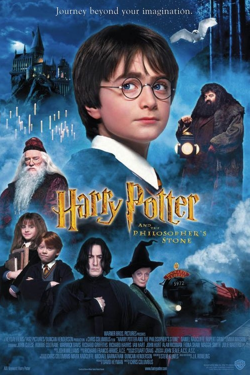
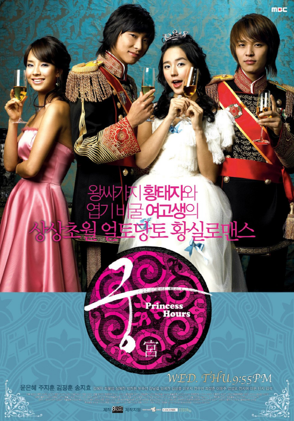

# LALA Philharmonic Orchestra, 2022

LALA Philharmonic 1st Viloinist  |  <a href='https://www.facebook.com/jskim.kr'>F.B : JS Luke, Kim </a>

## 라라 필하모닉 오케스트라 
<table border=0 width='960px'>
  <tr>
    <td width='50%'>
      
    </td>
    <td width='50%'>
      
    </td>
  </tr>
  <tr>
    <td> 
      <a href="https://youtu.be/oEzeAli7J6o">HARRY POTTER OST hedwig's theme 현악4중주 커버</a>
    </td>
    <td>
      <a href="https://youtu.be/rJXEk7oqDkw">궁OST : 두번째달 "얼음연못" String Quartet Ver.</a>
    </td>
  </tr>
</table>

## 앙상블 : 라라필 이벤트 콘서트 in 2022.03 
해리포터 & 궁OST Medley  악보 
- [4중주 악보 - ver1][Quartet_v1]
- [4중주 악보 - ver2][Quartet_v2]
- [4중주 악보 - ver3][Quartet_v3]

[Quartet_v1]: ./ensemble/quartet_v1_hedwigs_theme                        "Go Quartet_v1"
[Quartet_v2]: ./ensemble/quartet_v2_harrypotter+palace_medley        "Go Quartet_v2"
[Quartet_v3]: ./ensemble/quartet_v3_harrypotter+palace_final            "Go Quartet_v3"

